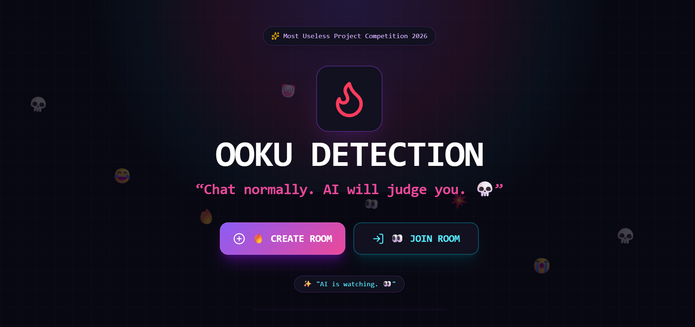
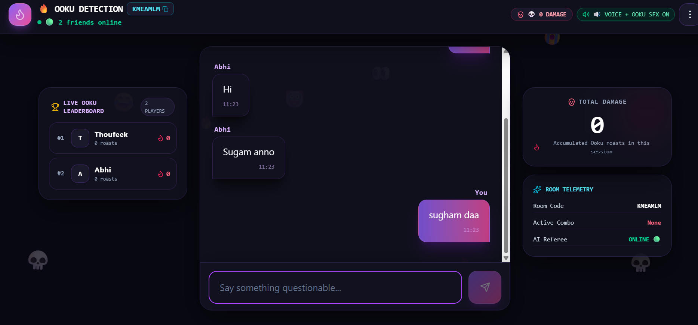
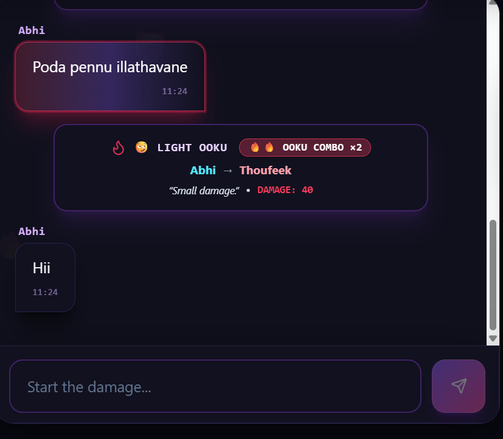
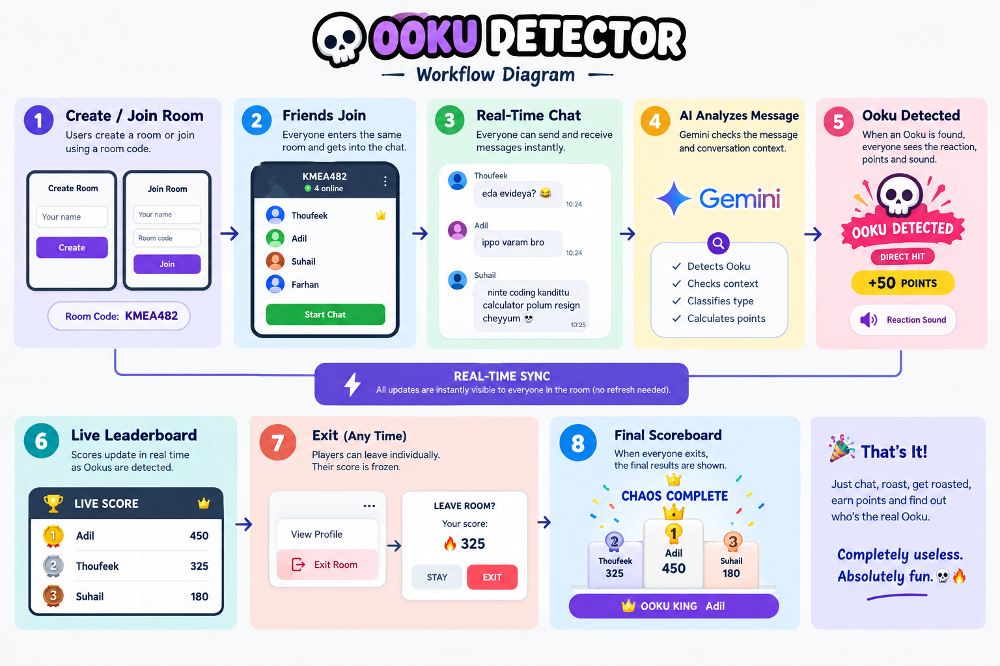

# OOKU DETECTOR 💀

## Basic Details

### Team Name: Fly High

### Team Members

* Team Lead: Muhammad Thoufeeq S - KMEA Engineering College
* Member 2: Abhijith ML - KMEA Engineering College

### Project Description

OOKU DETECTOR is a real-time multiplayer group chat where AI detects when your friends roast, tease, or counter-roast each other.

Chat normally. AI silently judges the conversation, detects Ooku, gives points, plays reactions, and decides who caused the most damage. 💀🔥

### The Problem (that doesn't exist)

Nobody knows when a joke between friends officially becomes an **Ooku**.

Is it just a normal message?

Was that a roast?

Was that a direct hit?

Was it a counter-attack?

Humanity has struggled with these questions for far too long. 💀

### The Solution (that nobody asked for)

We built an AI-powered referee for friend-group chats.

Create a room, invite your friends, and start chatting. AI analyzes the conversation and automatically detects Ooku in Malayalam, Manglish, and English.

When someone gets roasted:

**💬 Message → 🤖 AI Judge → 💀 Ooku Detected → 🔥 Points → 😂 Chaos**

Finally, the leaderboard reveals who caused the most damage.

Completely unnecessary.

Completely useless.

Absolutely important. 😂

## Technical Details

### Technologies/Components Used

For Software:

* **Languages:** JavaScript, HTML, CSS
* **Framework:** React + Vite
* **Libraries:** Framer Motion, Google GenAI SDK
* **Backend:** Supabase Edge Functions
* **Database:** PostgreSQL
* **Realtime:** Supabase Realtime
* **AI:** Google Gemini API
* **Voice:** Gemini Text-to-Speech
* **Tools:** Git, GitHub, VS Code / Antigravity
* **Deployment:** Vercel
* **Audio:** Custom Ooku reaction sound effects

For Hardware:

* No special hardware required
* Works on smartphones, tablets and computers
* Internet connection required

### Implementation

For Software:

# Installation

```bash
git clone https://github.com/Thoufeeqquezz/ooku-detector.git
cd ooku-detector
npm install
```

Create a `.env` file and add the required Supabase configuration:

```env
VITE_SUPABASE_URL=your_supabase_url
VITE_SUPABASE_ANON_KEY=your_supabase_anon_key
```

Configure the Gemini API key securely in the Supabase Edge Function environment.

# Run

```bash
npm run dev
```

Open the local development URL shown in the terminal.

The application can then be tested using multiple browsers/devices by joining the same room code.

### Project Documentation

For Software:

# Screenshots



*Simple home screen where users can create or join an Ooku room.*



*Real-time multiplayer chat where everyone in the same room sees messages instantly.*



*AI detects an Ooku and displays the damage, points and funny reaction.*

# Diagrams



*OOKU DETECTOR workflow: users join a shared room, exchange messages in real time, Gemini analyzes messages, and detected Ooku events update the points and leaderboard for everyone.*

### Project Demo

# Video

[Add your demo video link here]

*The demo shows room creation, multiplayer joining, real-time chatting, AI-powered Ooku detection, voice playback, scoring, reactions and the final leaderboard.*

# Additional Demos

* Live multiplayer room demonstration
* AI Ooku detection demonstration
* Gemini text-to-speech demonstration
* Final scoreboard demonstration

## Team Contributions

* **Muhammad Thoufeeq S:** Project concept, UI/UX design, React frontend, multiplayer chat flow, Supabase integration, AI integration and overall development.
* **[Member 2]:** [Specific contributions]
* **[Member 3]:** [Specific contributions]
* **[Member 4]:** [Specific contributions]

---

Made with ❤️ at TinkerHub Useless Projects


